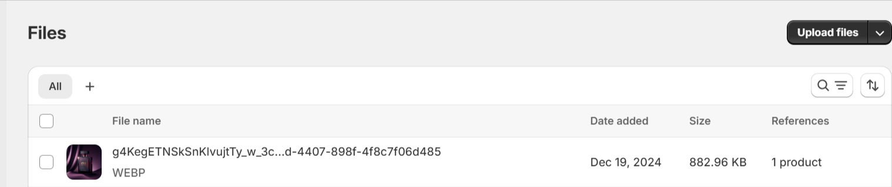

# How do I add custom fonts to MAVEN theme?

Shopify, by default, has support for its own fonts and other custom fonts should be added via customization.

There are a couple of steps to add your web fonts. Let’s get started.

#### 1) Upload your fonts to Shopify

Download the Webfont version of your fonts. The font files must include the **WOFF** and **WOFF2** file types (TTF or OTF are not Webfont file types).\
\
Upload these fonts to Shopify using **Shopify Admin > Settings > Files**:

<figure><figcaption><p>Click on Copy link button to get the URL of the font file.</p></figcaption></figure>

#### 2) Add your @font-face rules

The next step is to add your @font-faces rules to **snippets/head-variables.liquid** file from **Shopify Admin > Themes > Edit Code** and then select Snippets/head-variables.liquid file.

Find ``

and add below the below code, filling out the **name of your font file** and the **url of your font fil**e from the Files screen.

```css
@font-face {
font-family: "NAME OF FONT";
src: url("URL-OF-FONT-FILE.woff2") format("woff2");
}
```

#### 3) Change font-family for headings or body

Inside the same file, you ‘ll find:

```css
h1,h2,h3,h4,h5,h6,
.h1,.h2,.h3,.h4,.h5,.h6,
.logolink.text-logo,
.heading-font,
.h1-xlarge,
.h1-large,
blockquote p,
blockquote span,
.customer-addresses .my-address .address-index  {
font-style: {{ heading_font.style }};
font-weight: {{ heading_font.weight }};
font-family: {{ heading_font.family }};
}

body,
.body-font,
.thb-product-detail .product-title {
font-style: {{ body_font.style }};
font-weight: {{ body_font.weight }};
font-family: {{ body_font.family }};
}
```

You can replace `{{ heading_font.family }}` and `{{ body_font.family }}` with your font name. So for example, the end result should be:

```css
h1,h2,h3,h4,h5,h6,
.h1,.h2,.h3,.h4,.h5,.h6,
.logolink.text-logo,
.heading-font,
.h1-xlarge,
.h1-large,
.customer-addresses .my-address .address-index {
font-style: normal;
font-weight: 600;
font-family: "NAME OF FONT";
}

body,
.body-font,
.thb-product-detail .product-title {
font-style: normal;
font-weight: 400;
font-family: "NAME OF FONT";
}
```
