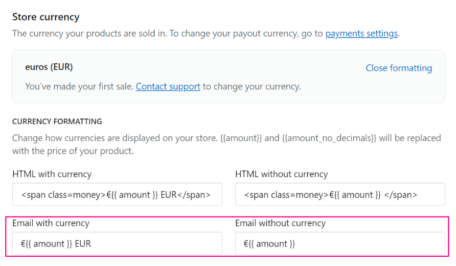
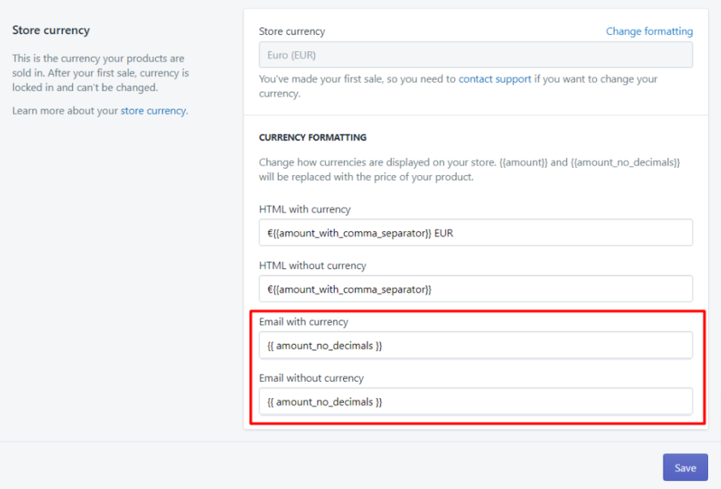

# Adding/removing decimal prices on Shopify

This depends on how “money formatting” is set up in your Shopify admin. Here’s how to check and how to customize it:

### Not seeing decimals on your prices?&#x20;

1- Go to this page in your Shopify admin: [https://shopify.com/admin/settings/general](https://shopify.com/admin/settings/general)

2- Scroll down to “Store currency”  and click the blue “Change formatting” link.

3- Check if the “Email with currency” and “Email without currency” fields are set up to not use decimals. They will say `{{amount_no_decimals}}`  for example. If so, change that to `{{amount}}`  instead.

<figure><figcaption></figcaption></figure>

4- Click “Save”.

### Do you want to remove decimals?

1- Go to this page in your Shopify admin: [https://shopify.com/admin/settings/general](https://shopify.com/admin/settings/general)

2- Scroll down to “Store currency” and click the blue “Change formatting” link.

3- Change the bottom 2 fields, where email money formats are set, by changing this part:

```
{{ amount }}
```

to:

```
{{ amount_no_decimals }}
```

<figure><figcaption></figcaption></figure>

4- Click “Save”.

**Note:** It can take 15 minutes before the app picks up on the changes- After that, it will show the prices as you need.
