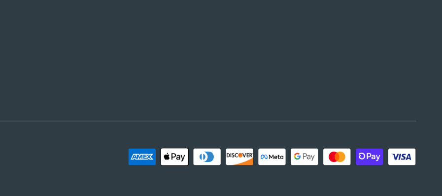

# Payment icons are not showing up inside the footer section.

<figure><figcaption>
Payment icons on MAVEN theme.
</figcaption></figure>

Payment icons can be enabled inside the Footer section settings, but sometimes it does not appear for all payment methods.

### Why are icons not showing up?

Shopify has made changes to how Payment Methods are integrated into shops, and as a result of those changes, **only the payment options accepted by Shopify Payments** show icons on the footer.

Third-party payment gateways are no longer shown automatically. This may change in the future, but there are no estimates as to when.

For any further questions regarding this, we recommend reaching out to Shopify directly.
