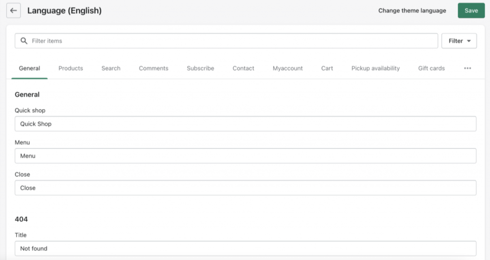

# Using the theme language editor

**Internationalization** is a standardized framework that renders themes entirely translatable while leaving the translations open-ended and up to the merchant. Use the **Edit languages** settings to access this framework, then translate to another language or modify the current language for your theme.

A common topic with Shopify and themes is “**Does your theme support selling in multiple languages?**“. The answer is **yes**, but there are some additional aspects of this question that you may not be aware of at first. We will discuss them below.

To access the **Edit languages** settings:

1. In the **Online Store**, locate your theme
2. Select the **Actions** dropdown
3. Select **Edit Default Theme Content**

<figure><figcaption>
Select “Edit default theme content” under Actions dropdown
</figcaption></figure>

<figure><figcaption>
Easily translate theme phrases inside “Edit Languages” screen.
</figcaption></figure>

#### **Does my Shopify subscription plan matter?**

If you are just looking to translate the language of the theme and that’s it, then plans have no effect. Shopify plans are required when comes to translating your theme into multiple languages that the customer can choose from. At this time any store can sell in multiple languages but please [click this link](https://www.shopify.com/pricing?ref=cleancanvas\&utm_campaign=in-page-support) and scroll down till you see “**Global Selling**” for more details about what is required in order to translate your theme as Shopify may update their conditions over time.

#### **Are there any limitations when it comes to selling in multiple languages?**

Yes, and these apply to all themes including Shopify’s free themes, and cannot be overridden by our themes or any third-party theme.

The search bar works only in the shop’s **primary** **language**. So if your primary language is English, and someone searches for a word in French, it won’t work. This is a Shopify limitation and not a theme one so we cannot change or override this.

Only [compatible third-party translation apps](https://apps.shopify.com/collections/apps-for-store-languages?ref=cleancanvas\&utm_campaign=in-page-support) are supported by this feature.

Tags (such as product tags, article tags, and blog tags) can’t be translated.

Product URLs, such as `/products/cool-looking-product`, aren’t translated and remain in the language that they were created in, even when a customer is viewing the site in another published language.

#### **Can I see my theme admin in a different language like Shopify’s own free themes?**

No. Shopify has the resources and team at hand in order to make this level of translations in their free themes and they don’t help third parties translate theirs. Our themes currently only support an English admin. We will continue to add more theme translations when we can.

#### **Will my URL change to indicate a different language.**&#x20;

Yes, the domain will display the common domain ending based on that language. .com/fr for French or .com/de for German etc. This is not controlled by the theme and cannot be changed based on Shopify support docs.
