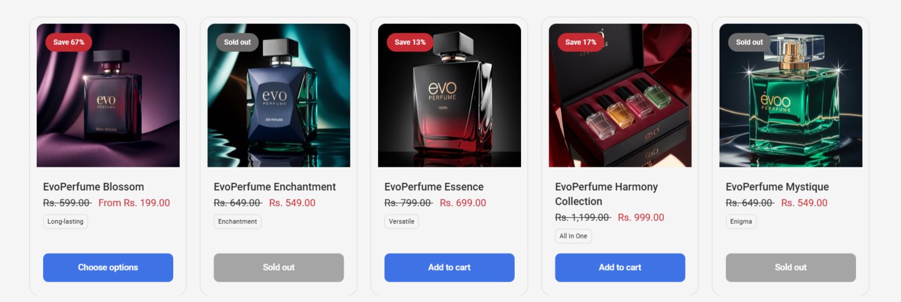
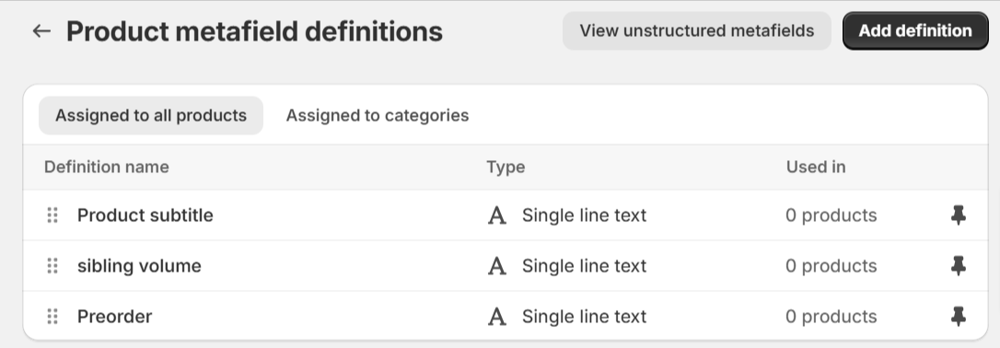
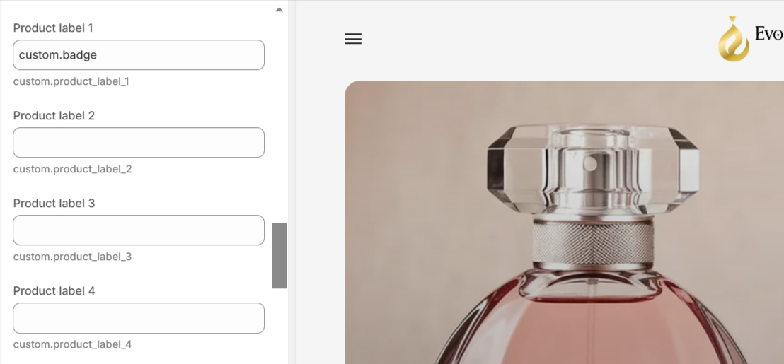
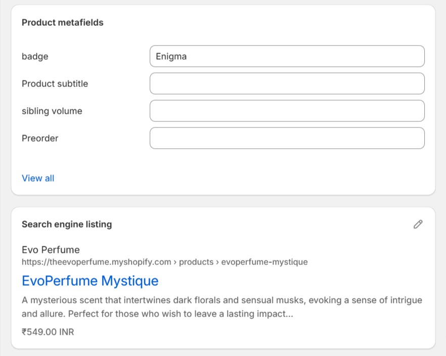

# How to add Product labels in MAVEN theme?

<figure><figcaption>
Small boxes such as “Unique, Affordable, and Volume Control” are referred to as Product labels
</figcaption></figure>

Product labels are a unique feature of MAVEN and quite handy when you want to feature product features within collection pages.

Product labels use Metafields and they can be configured by adding which metafields they are tied to.

### Start by creating metafields inside Shopify Admin > Settings > Metafields > Products:

<figure><figcaption>
Metafields with <strong>Single line text</strong> type.
</figcaption></figure>

### Add the metafield definitions inside Theme settings > Product Card > Product Labels:

<figure><figcaption></figcaption></figure>

### Fill the data for Product label metafields inside each Edit Product screen:

<figure><figcaption></figcaption></figure>
